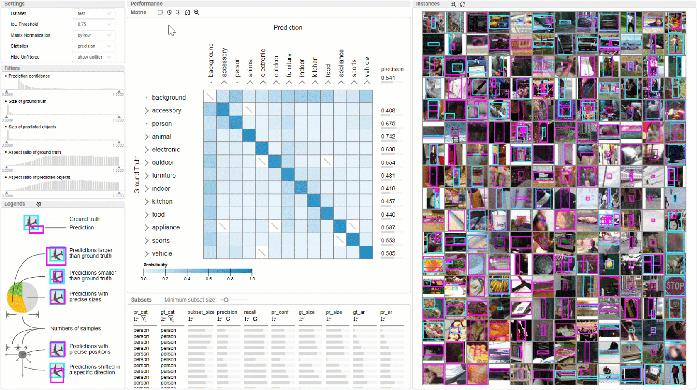

# Uni-Evaluator: A unified interactive model evaluation for classification, object detection, and instance segmentation in computer vision


**Uni-Evaluator** is a visual analysis tool to support a unified model evaluation for different computer vision tasks, including classification, object detection, and instance segmentation.



An online demo: [demo](http://thuvis.org:8084/)

## Quick start
### 1. Download repo
```bash
git clone https://github.com/thu-vis/Uni-Evaluator.git
cd Uni-Evaluator
```
### 2. Setup environment

(This repo is tested with [node_v16](https://nodejs.org/download/release/v16.20.0/) and [python3.8](https://www.python.org/downloads/release/python-3813/) on Ubuntu)

#### a. setup frontend environment

```bash 
npm install -g yarn
cd frontend
yarn
```
#### b. setup backend environment
```bash
# install from requirements.txt
cd ../backend
# install the packages in order
cat requirements.txt | xargs pip install

# install RangeTree
cd ./data/RangeQuery
python setup.py build_ext --inplace
cd ../../

# install fastlapjv
git clone git@github.com:thu-vis/fast-lapjv.git
cd fast-lapjv/
python setup.py install --user
cd ../

# install faiss (you can also follow https://github.com/facebookresearch/faiss/blob/main/INSTALL.md)
conda install -c pytorch faiss-gpu
# or
conda install -c pytorch faiss-cpu
```

### 3. download data
We provide COCO test data used in our case study for demonstration, which can be downloaded [here](https://cloud.tsinghua.edu.cn/f/2065a52b451e4a91883f/?dl=1). It corresponds to the **dataPath** below.

### 4. run
```bash
# start backend
cd backend
python server.py \
    --dataPath <path> \ # contains sub-directories with training or test data
    --seg \ # added for segmentation task
    --dataName <name> # the name of dataset, e.g., "COCO", "iSAID"
    --host <host> \
    --port <port> \
cd ../

# start frontend
cd frontend
yarn start
```
